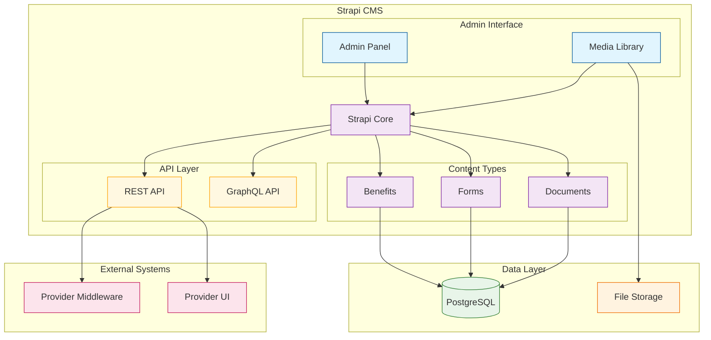
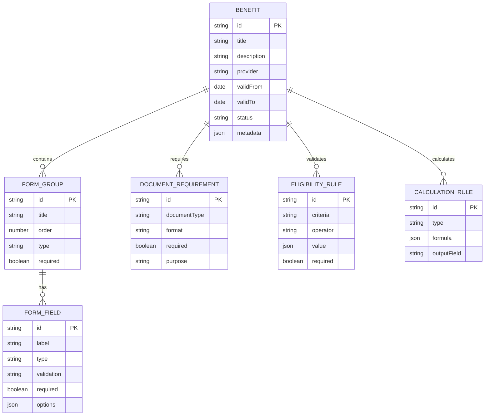
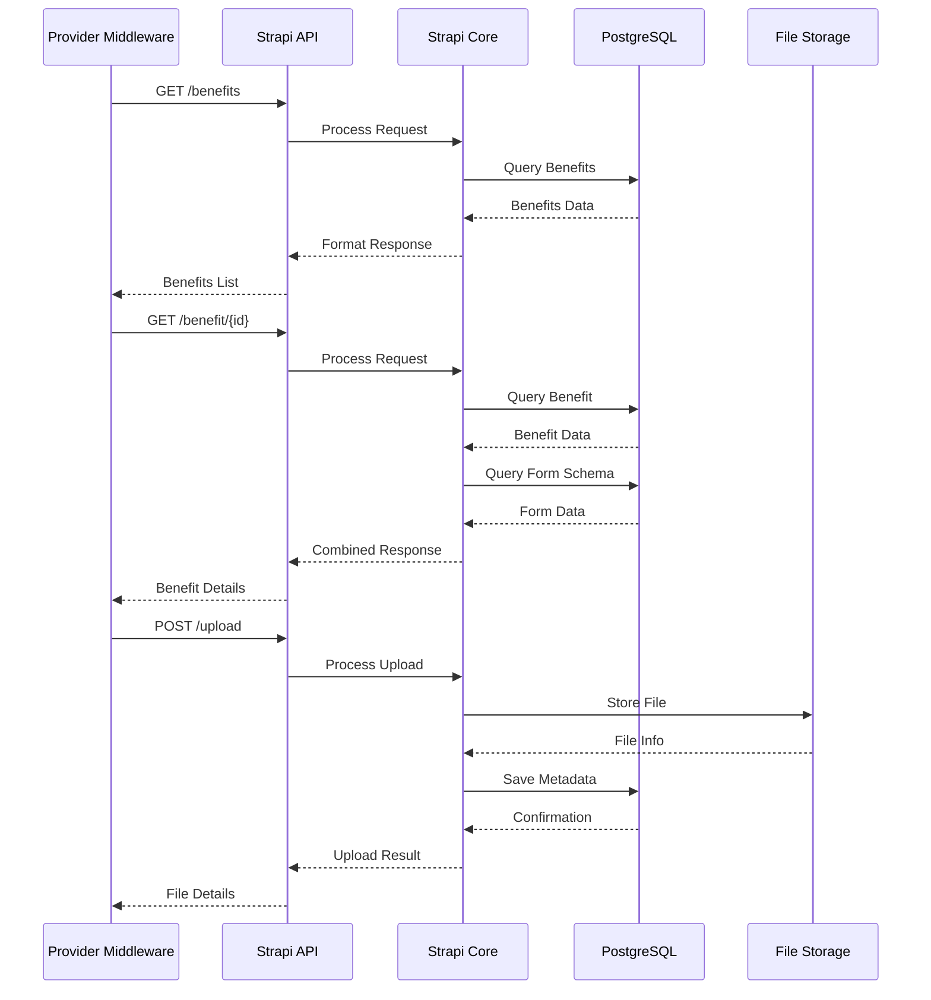
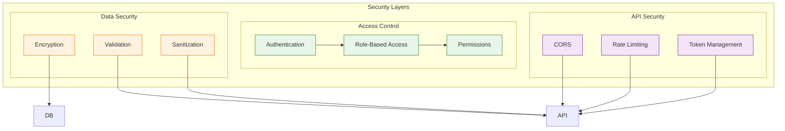

# Architecture Diagrams

Visual representations of the UBI Strapi Provider's architecture and data flows.

## System Architecture

### High-Level Overview

### Content Type Structure

### API Flow Diagram

## Component Details

### Benefit Management
- Benefit definition and configuration
- Form builder and schema management
- Document requirements specification
- Eligibility rules configuration
- Benefit calculation rules

### Form Management
- Dynamic form generation
- Field validation rules
- Multi-step form configuration
- Conditional field logic
- Form versioning

### Document Management
- Document type definitions
- Format specifications
- Validation requirements
- Storage configuration
- Access control

### API Features
- RESTful endpoints
- GraphQL support
- Authentication & authorization
- Rate limiting
- Response formatting

## Security Architecture

## Notes

1. This architecture supports the Provider system's requirements for benefit and form management
2. The system is designed for extensibility and scalability
3. Security is implemented at multiple layers
4. APIs are versioned and documented
5. Data validation occurs at multiple levels