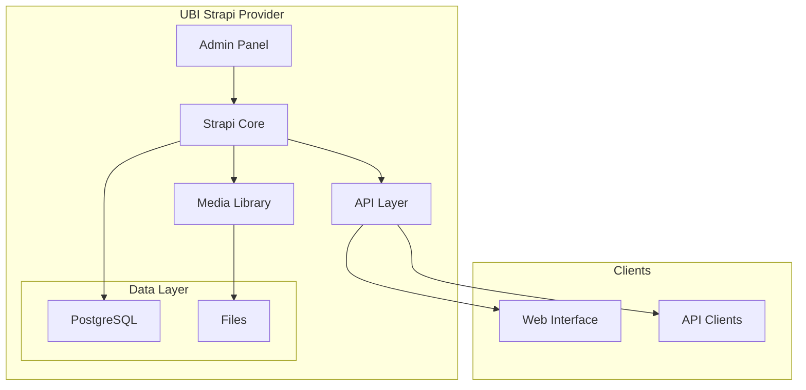
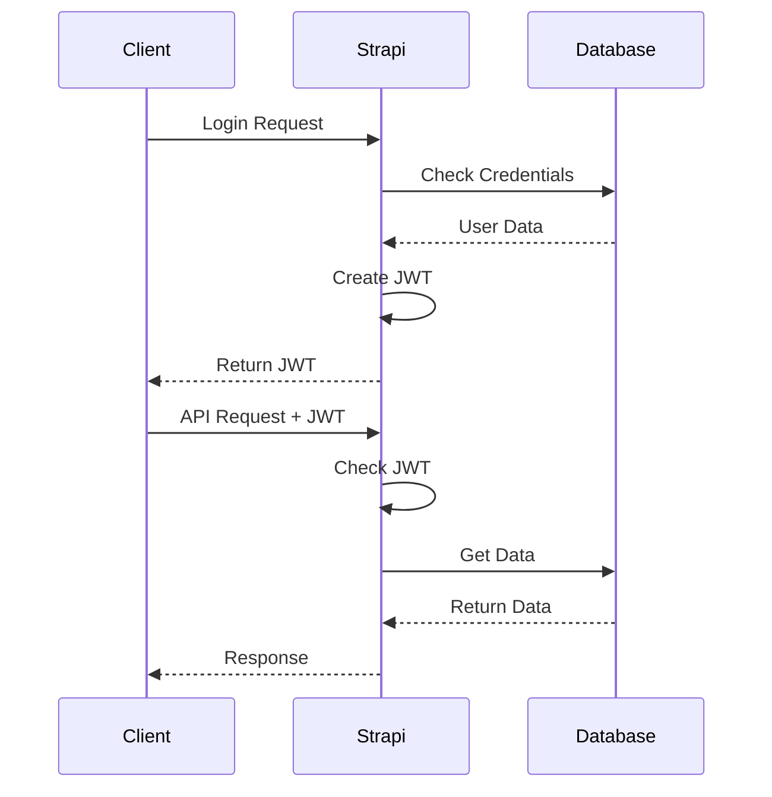
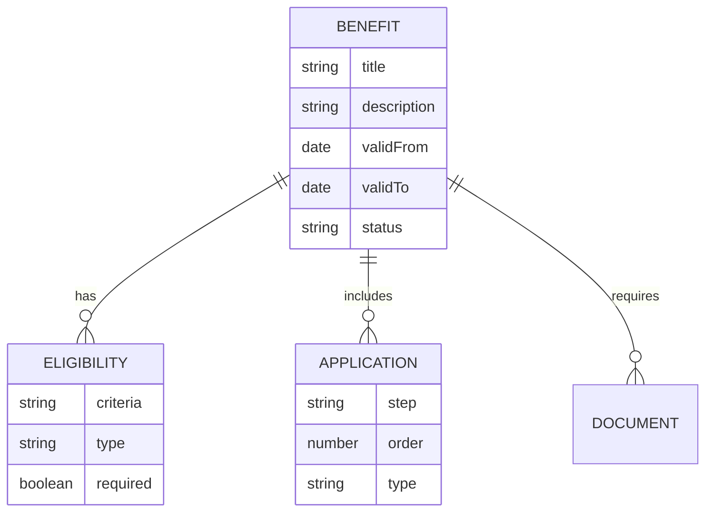

# Architecture Diagrams

Basic visual representations of the UBI Strapi Provider's structure.

## System Overview

## Authentication Flow

## Data Structure

## Notes

1. These are simplified diagrams for basic understanding
2. Actual implementation may have additional features
3. Use as a general reference for system structure